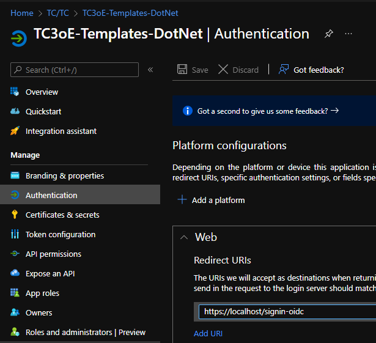
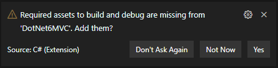
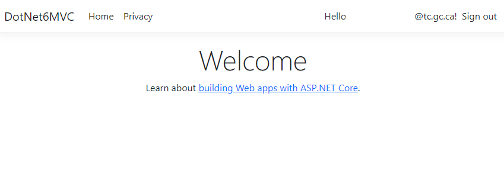
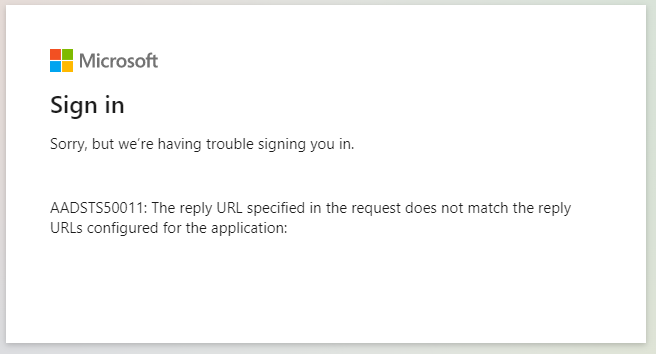

# DotNet6 Quickstart

The goal of this project is not to provide a template for you to clone (although you may still find cloning this useful).  
Instead, this guide will tell you how to expand on the built in templates that the `dotnet new` command provides.

This ensures that new projects will benefit from changes to the builtin templates, while also increasing understanding of changes that we suggest making.

This guide expects you to be using Visual Studio Code with the C# extension installed.

## Features added

- AzureAD Authentication
- Localization
- WET support

## Walthrough

This guide will focus on MVC as it the standard used by the majority of TC development teams.

### Initializing the project

Run this command in an empty folder where you want your project to be located.  
The name of this folder will determine the project name and namespace used by the autogenerated files.

```powershell
dotnet new mvc --auth SingleOrg
```

### Local auth config

This expects you to have already acquired an app registration in the Azure Active Directory.

From the autogenerated `appsettings.json`, replace the `AzureAd` block with the following:

```json
  "AzureAd": {
    "Instance": "https://login.microsoftonline.com/",
    "Domain": "tc.gc.ca",
    "CallbackPath": "/signin-oidc"
  },
```

Replace the following values with those associated with your app registration and run these commands to set the secrets needed to run.

```powershell
dotnet user-secrets set AzureAd:ClientId "11111111-1111-1111-11111111111111111"
dotnet user-secrets set AzureAd:TenantId "22222222-2222-2222-2222-222222222222"
```

This will allow the app to work without storing these values in your repo.  
See also: [should I consider my Azure tenant id a secret?](https://security.stackexchange.com/questions/238696/should-i-consider-my-azure-tenant-id-as-a-secret)

### Azure auth config

You will need to add the reply url to your app registration in the Azure portal to ensure you don't get errors while logging in.  
In this case, the reply URL is `https://localhost/signin-oidc`

_The port number can be omitted._



### Test run

At this point, you can test the app by running

```powershell
dotnet run
```

or by running

```powershell
dotnet watch run
```

which will reload the app when changes are made.

Alternatively, the C# extension will prompt you to add build configs which allows you to run using your VSCode shortcuts.



Sometimes I get errors using the VSCode launch instead of the command, so try the command if you get weird errors such as `Index.cshtml not found`.

You should see your email in the top right if the signin is working.



If the reply urls are misconfigured, you will receive an error like this:



### Gitignore

The build process generates some files we don't care about.  
Rather than creating a `.gitignore` file manually, you can just use the following command:

```powershell
dotnet new gitignore
```

### Adding localization

[We are responsible for ensuring that we deliver content in both official languages](https://www.tbs-sct.gc.ca/pol/doc-eng.aspx?id=26164). This doesn't necessarily _require_ that the URL (beyond the domain name) is also localized, but it's not difficult to add.

Microsoft guides on ASP.NET localization are available [here](https://docs.microsoft.com/en-us/aspnet/core/fundamentals/localization?view=aspnetcore-6.0), but this document will include everything needed to get started.

First we will create the file `Helpers/RouteDataRequestCultureProvider.cs`

_The folder may need to be created._

```c#
using Microsoft.AspNetCore.Localization;

namespace DotNet6MVC.Helpers;

// Custom class since RouteDataRequestCultureProvider doesn't work.
// Route values aren't available I guess, so we grab from the request path.
// https://github.com/aspnet/Localization/blob/master/src/Microsoft.AspNetCore.Localization.Routing/RouteDataRequestCultureProvider.cs
public class UrlRequestCultureProvider : RequestCultureProvider
{
	// Suppress warning about "different" return type nullability.
	// https://github.com/dotnet/roslyn/issues/40757
#pragma warning disable CS8609
	public override Task<ProviderCultureResult> DetermineProviderCultureResult(HttpContext Context)
	{
		var culture = Context?.Request?.Path.Value?.Split('/')[1];
		if (culture == null)
			return Task.FromResult(new ProviderCultureResult(DefaultCulture));

		return Task.FromResult(
			IsValidCulture(culture)
			? new ProviderCultureResult(culture)
			: new ProviderCultureResult(DefaultCulture)
		);
	}

	private bool IsValidCulture(string culture)
	{
		return Options!.SupportedCultures!.Any(x => x.TwoLetterISOLanguageName.Equals(culture, StringComparison.InvariantCultureIgnoreCase));
	}

	private string DefaultCulture => Options!.DefaultRequestCulture.Culture.TwoLetterISOLanguageName;
}
```

Inside `Program.cs` we want to make a few changes:

```diff
-using Microsoft.AspNetCore.Authentication;
+using DotNet6MVC.Helpers;
 
...
 
+builder.Services.AddLocalization(options => options.ResourcesPath = "Resources");
+builder.Services.Configure<RequestLocalizationOptions>(options => 
+{
+    options.AddSupportedCultures("en","fr");
+    options.AddSupportedUICultures("en","fr");
+    options.SetDefaultCulture("en");
+    options.RequestCultureProviders = new[]{
+        new UrlRequestCultureProvider { Options = options}
+    };
+});
 
 builder.Services.AddControllersWithViews(options =>
 {
+    options.EnableEndpointRouting = true;
     var policy = new AuthorizationPolicyBuilder()
         .RequireAuthenticatedUser()
         .Build();
     options.Filters.Add(new AuthorizeFilter(policy));
-});
+})
+.AddViewLocalization();
 
...
 
 if (!app.Environment.IsDevelopment())
 {
-    app.UseExceptionHandler("/Home/Error");
+    app.UseExceptionHandler(o =>
+    {
+        o.Run(ctx =>
+        {
+            var language = ctx.Request.Path.Value?.Length >= 3 ? ctx.Request.Path.Value.Substring(1, 2) : "en";
+            if (language.Equals("en")) ctx.Response.Redirect($"{ctx.Request.PathBase.Value}/{language}/error");
+            if (language.Equals("fr")) ctx.Response.Redirect($"{ctx.Request.PathBase.Value}/{language}/erreur");
+            return Task.CompletedTask;
+        });
+    });
     // The default HSTS value is 30 days. You may want to change this for production scenarios, see https://aka.ms/aspnetcore-hsts.
     app.UseHsts();
 }
 
...
 
 app.UseHttpsRedirection();
 app.UseStaticFiles();
 
+app.UseRequestLocalization();
 
...
 
 app.MapControllerRoute(
     name: "default",
-    pattern: "{controller=Home}/{action=Index}/{id?}");
+    pattern: "{culture}/{controller}/{action}/{id?}"
+);
 

 app.MapRazorPages();
 
 app.Run();
```

From here, we can add custom urls to our controller methods.  
In `HomeController.cs`

```diff
+    [HttpGet("/{culture:regex(en)}/home")]
+    [HttpGet("/{culture:regex(fr)}/accueil")]
+    [HttpGet("/{culture:regex(en)}")]
+    [HttpGet("/{culture:regex(fr)}")]
+    [HttpGet("/")]
    public IActionResult Index()
    {
        return View();
    }
    
+    [HttpGet("/{culture:regex(en)}/privacy")]
+    [HttpGet("/{culture:regex(fr)}/confidentialité")]
    public IActionResult Privacy()
    {
        return View();
    }

    
    [AllowAnonymous]
    [ResponseCache(Duration = 0, Location = ResponseCacheLocation.None, NoStore = true)]
+    [HttpGet("/{culture:regex(en)}/error")]
+    [HttpGet("/{culture:regex(fr)}/erreur")]
    public IActionResult Error()
    {
        return View(new ErrorViewModel { RequestId = Activity.Current?.Id ?? HttpContext.TraceIdentifier });
    }
```

Note that this changes the route from `/Home/Privacy` to `/en/privacy` since we explicitly set the route.  
If we created a new endpoint without an `HttpGet` decorator, it would follow the normal convention.

For example:

```c#
public IActionResult Beans()
{
    return View();
}
```

This route would be accessible from `/en/Home/Beans` and `/fr/Home/Beans` (since the controller is called `Home`).  
Explicitly setting the routes lets them be fully localized instead of just using the method names.


We also want to edit `Views/_ViewImports.cshtml` to get access to the localizer object.

```diff
@using DotNet6MVC
@using DotNet6MVC.Models
@addTagHelper *, Microsoft.AspNetCore.Mvc.TagHelpers

+@using Microsoft.AspNetCore.Mvc.Localization
+@inject IViewLocalizer Localizer
```

Now we can localize page content, for example: `Views/Home/Index.cshtml`

```cshtml
@{
    ViewData["Title"] = "Home Page";
}

<div class="text-center">
    <h1 class="display-4">@Localizer["Header"]</h1>
    <p>@Localizer["Body"]</p>
</div>
```

with resx files being created under `Resources/Views/Home/Index.en.resx` and `Resources/Views/Home/Index.fr.resx`

### Adding WET

The Web Experience Toolkit (WET) framework enables government sites to share a common look and feel without having to [reimplement everything from scratch](https://www.canada.ca/en/treasury-board-secretariat/services/government-communications/federal-identity-program/technical-specifications/web-mobile-presence.html).

First we will create an extension helper in `Extensions/HttpContextExtensions.cs`

```c#
using Microsoft.AspNetCore.Mvc;
using Microsoft.AspNetCore.Mvc.Routing;

namespace DotNet6MVC.Extensions;

public static class HttpContextExtensions
{
	public static string GetCurrentCulture(this HttpContext Context)
	{
		return Context.Features.Get<Microsoft.AspNetCore.Localization.IRequestCultureFeature>()
		!.RequestCulture.Culture.TwoLetterISOLanguageName;
	}

	public static string GetFlippedLanguageLinkObject(this HttpContext Context, IUrlHelper Url)
	{
		var flippedCulture = Context.GetCurrentCulture() == "en" ? "fr" : "en";
		var flippedCultureName = flippedCulture == "fr" ? "Français" : "English";
		
		// Create new route data, set culture to flipped value
		var flippedCultureRouteData = new RouteData(Context.GetRouteData());
		flippedCultureRouteData.Values["culture"] = flippedCulture;
		
		// Construct URL using flipped localization
		var flippedCultureHref = Url.RouteUrl(flippedCultureRouteData.Values);
		// Persist query parameters
		for (var i = 0; i < Context.Request.Query.Count; i++)
		{
			var (key, value) = Context.Request.Query.ElementAt(i);
			if (i == 0) flippedCultureHref += "?";
			else flippedCultureHref += "&";
			flippedCultureHref += $"{key}={value}";
		}

		// Return WET JS object
		return $@"{{
			lang: ""{flippedCulture}"",
			href: ""{flippedCultureHref}"",
			text: ""{flippedCultureName}""
		}}";
	}
}
```

We also want to edit `Views/_ViewImports.cshtml` again to add our extension methods

```diff
@using DotNet6MVC
@using DotNet6MVC.Models
+@using DotNet6MVC.Extensions
@addTagHelper *, Microsoft.AspNetCore.Mvc.TagHelpers

@using Microsoft.AspNetCore.Mvc.Localization
@inject IViewLocalizer Localizer
```

Now we can make our app adopt the government theming by editing `Views/Shared/_Layout.cshtml`

```diff
-<html lang="en">
+<html lang="@Context.GetCurrentCulture()">
 <head>
+    <meta http-equiv="content-language" content="@Context.GetCurrentCulture()-CA" />
     <meta charset="utf-8" />
     <meta name="viewport" content="width=device-width, initial-scale=1.0" />
     <title>@ViewData["Title"] - DotNet6MVC</title>
-    <link rel="stylesheet" href="~/lib/bootstrap/dist/css/bootstrap.min.css" />
     <link rel="stylesheet" href="~/css/site.css" asp-append-version="true" />
     <link rel="stylesheet" href="~/DotNet6MVC.styles.css" asp-append-version="true" />
+    
+    @* WET CDTS *@
+    <script src="https://ssl-templates.services.gc.ca/rn/cls/wet/gcintranet/cdts/compiled/soyutils.js"></script>
+    <script src="https://ssl-templates.services.gc.ca/rn/cls/wet/gcintranet/cdts/compiled/wet-@(Context.GetCurrentCulture()).js"></script>
+    <script>
+        document.write(wet.builder.refTop({}));
+    </script>
+    
+    @* Configure WET apptop TODO *@
+    <script>
+        let appTop = {
+            appName: [{ text: "@Localizer["AppName"]", href: "@Url.Action("Index", "Home", new {culture= @Context.GetCurrentCulture()})" }],
+            lngLinks: [
+                @Html.Raw(Context.GetFlippedLanguageLinkObject(Url))
+            ],
+            breadcrumbs: [
+                {
+                    title: "@Localizer["Breadcrumb.Home"]",
+                    href: "@Url.Action("Index", "Home", new {culture= @Context.GetCurrentCulture()})",
+                },
+            ]
+        };
+    </script>
+    @* Add per-page apptop config *@
+    @await RenderSectionAsync("AppTop", required: false)
+
 </head>
 <body>
-    <header>
-        <nav class="navbar navbar-expand-sm navbar-toggleable-sm navbar-light bg-white border-bottom box-shadow mb-3">
-            <div class="container-fluid">
-                <a class="navbar-brand" asp-area="" asp-controller="Home" asp-action="Index">DotNet6MVC</a>
-                <button class="navbar-toggler" type="button" data-bs-toggle="collapse" data-bs-target=".navbar-collapse" aria-controls="navbarSupportedContent"
-                        aria-expanded="false" aria-label="Toggle navigation">
-                    <span class="navbar-toggler-icon"></span>
-                </button>
-                <div class="navbar-collapse collapse d-sm-inline-flex justify-content-between">
-                    <ul class="navbar-nav flex-grow-1">
-                        <li class="nav-item">
-                            <a class="nav-link text-dark" asp-area="" asp-controller="Home" asp-action="Index">Home</a>
-                        </li>
-                        <li class="nav-item">
-                            <a class="nav-link text-dark" asp-area="" asp-controller="Home" asp-action="Privacy">Privacy</a>
-                        </li>
-                    </ul>
-                    <partial name="_LoginPartial" />
-                </div>
-            </div>
-        </nav>
-    </header>
+    @* WET header *@
+    <div id="def-top"></div>
+    <script>
+        var defTop = document.getElementById("def-top");
+        defTop.innerHTML = wet.builder.appTop(appTop);
+    </script>
+
     <div class="container">
         <main role="main" class="pb-3">
             @RenderBody()
         </main>
     </div>
 
-    <footer class="border-top footer text-muted">
-        <div class="container">
-            &copy; 2022 - DotNet6MVC - <a asp-area="" asp-controller="Home" asp-action="Privacy">Privacy</a>
-        </div>
-    </footer>
-    <script src="~/lib/jquery/dist/jquery.min.js"></script>
-    <script src="~/lib/bootstrap/dist/js/bootstrap.bundle.min.js"></script>
     <script src="~/js/site.js" asp-append-version="true"></script>
+    
+    @* WET footer display *@
+    <footer id="def-footer"></footer>
+    <script>
+        var defFooter = document.getElementById("def-footer");
+        defFooter.innerHTML = wet.builder.footer({});
+    </script>
+    @* WET footer scripts *@
+    <script>
+        document.write(wet.builder.refFooter({}));
+    </script>
+
     @await RenderSectionAsync("Scripts", required: false)
 </body>
 </html>
```

Create files under `Resources/Views/Shared/_Layout.en.resx` and `Resources/Views/Shared/_Layout.fr.resx`

Example values:

en:

```ini
AppName=MyApp
Breadcrumb.Home=Home
```

fr:

```ini
AppName=MonApp
Breadcrumb.Home=Accueil
```

We can also delete the contents of the folder `wwwroot/lib`.

We can also empty the contents of the file `wwwroot/css/site.css`.

An example of how a page can modify the WET apptop:

```html
@section AppTop {
<script>
    appTop.breadcrumbs.push({
        title: "@Localizer["Header"]",
        href: "@Url.Action("Create", "MyController", new {culture=@Context.GetCurrentCulture()})",
    });
</script>
}
```

Since the `appTop` object is defined in javascript before the `AppTop` section is rendered, pages can include script blocks to modify the object before the app renders it.
