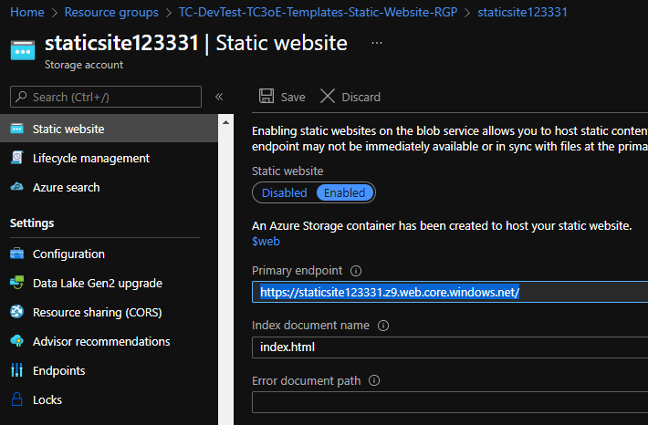
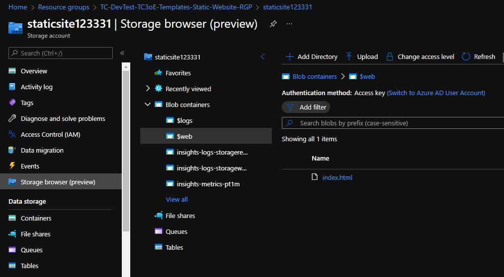
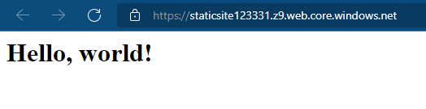
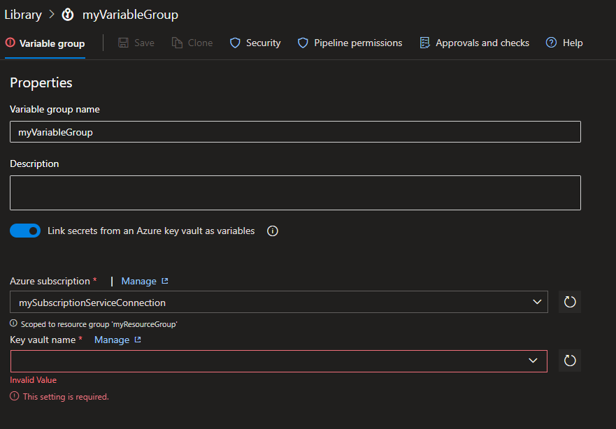
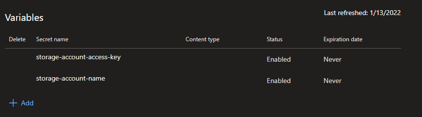

# Static Websites in Azure

The most basic setup for a static website in Azure is to use a storage account.

Microsoft documentation on setting this up is available [here](https://docs.microsoft.com/en-us/azure/storage/blobs/storage-blob-static-website), but this document will explain what is needed.

## Infrastructure

See the [IaC folder](./IaC/) for a scripted version of what will now be explained.

1. Create a storage account in the Azure portal
1. In the `Static website` blade under `Data management`, enable the `Static website` toggle  

	- The Terraform module parameter documentation is available [here](https://registry.terraform.io/providers/hashicorp/azurerm/latest/docs/resources/storage_account#static_website)
	- This toggle is currently [unsupported by the Azure Resource Manager](https://github.com/Azure/azure-resource-manager-schemas/issues/2063), so it's not really possible to do this purely in Bicep
	- The Azure CLI documentation is available [here](https://docs.microsoft.com/en-us/cli/azure/storage/blob/service-properties?view=azure-cli-latest#az-storage-blob-service-properties-update), the basic command is `az storage blob service-properties update --account-name "myStorageAccount" --static-website true --index-document "index.html";`  
1. Upload your site's content to the `$web` blob container that should be created once the static website toggle was enabled  

In this case, the `index.html` file I uploaded is just one line: `<h1>Hello, world!</h1>`
	- The Azure CLI upload commands are available [here](https://docs.microsoft.com/en-us/cli/azure/storage/blob?view=azure-cli-latest#az-storage-blob-upload-batch)
1. Visit your site to verify everything is working. The URL for the site is available in the static website blade  

At this point, you can reverse proxy the site with an application gateway if you want.

The `Networking` blade in the Azure portal can also be used to restrict access to the static site, since the networking rules apply to the site in addition to traditional blob access.  
For example, you can allow only access from the same VNET that your application gateway is on to ensure that people have to use the reverse proxy to access the site.

## **Note that any IP or VNET networking restrictions will also be applied when trying to update the $web blob content, like during CI/CD**

If this is an issue, you can put a VM on the same VNET and put your devops agent on the VM using a self-hosted agent pool.

Note: microsoft hosted agents have IPs that are not able to be whitelisted to azure storage accounts. If you have whitelist requirements, just use a VNET for CI/CD.

## CI/CD with Azure DevOps

We can use Azure DevOps pipelines to have our site be automatically updated when we make changes in source control.

The deployment scripts in the [IaC folder](./IaC/) also create a key vault that will store the secrets required to update the contents of our site. We will never have to actually see these secrets.

1. Click the button to create a Variable Group in the `Library` tab of your DevOps project  

1. Enable the `Link secrets from an Azure key vault as variables` checkbox
1. Select or create a service connection to the resource group containing the key vault containing our storage access key
1. Select the secrets in our key vault to be included in the variable group  

1. Save the variable group
1. Add a folder called `$web` to your main branch, add your site assets here
1. Create a devops pipeline pointing to the [provided azure-pipelines.yml file](./azure-pipelines.yml)
1. Ensure the `azure-pipelines.yml` file has the correct branch, variable group, and service connection names
1. Run the pipeline manually
	- The first run may prompt you to approve the pipeline's access to the variable group we created, make sure you click "approve"

Unless you've added custom networking rules to your storage account, this should be all that is needed. From here, you can make a change to the contents of the `$web` folder in source control. Once you push your commit, devops should launch the pipeline and update your site content.